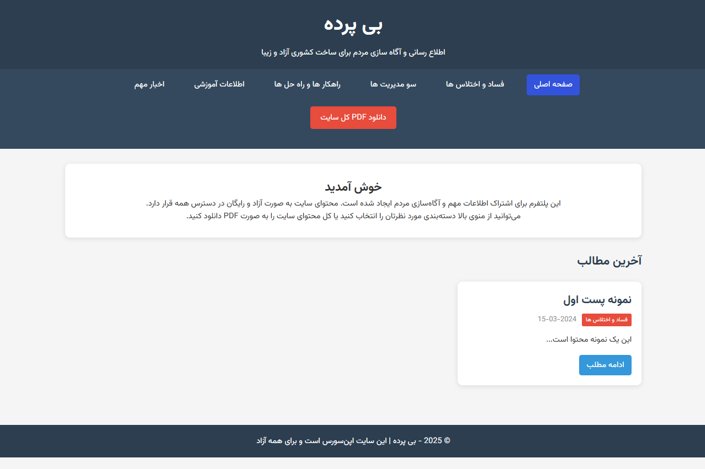

<div style="text-align: center">

[نسخه فارسی](./assets/README_fa.md)

</div>

# biPardeh

A simple website for informing and informing

## Features

- ✅ No need for a database (uses json files)
- ✅ Fully portable and transferable
- ✅ Responsive and mobile-friendly
- ✅ Support for right-clicking for Persian
- ✅ Ability to generate PDF (requires additional library)
- ✅ Content classification
- ✅ Clean and extensible code
- ✅ Has Persian font & Jalali date



## Installation and setup

### Step 1: Download the files

Place the following files in the main folder of the website:

### Step 2: Folder structure

```
BiPardeh/
├── assets/
│ └── README_fa.md (Persian Readme)
│ ├── Screen.png (Screenshot)
│ ├── style.css (Styles)
│ └── Vazirmatn-Regular.ttf (Font)
├── data/
│ └── posts/
│ ├── corruption/ (corruption and embezzlement)
│ ├── mismanagement/ (mismanagement)
│ ├── solutions/ (solutions)
│ ├── education/ (education)
│ ├── news/ (news)
│ └── Other
├── tools/
│ └── create_content.php (Content Creator Tool)
│ ├── generate_pdf.php (Complete PDF Generator with TCPDF)
│ ├── jdf.php (library for jalali)
│ └── textFormater.py (Text Formatter)
├── vendor/ (composer)
│ └── ...
├── helper.php (Helper Functions)
├── config.php (Configs)
├── index.php (Home page)
└── README.md (English Readme)
```

### Step 3: Add content

Place each post as a JSON file in the corresponding category folder:

#### Example: `data/posts/corruption/post-001.json`

<div style="direction: ltr">

```json
{
"title": "Post title",
"content": "Full text of the post...",
"date": "1404-06-25",
"author": "Author name",
"tags": ["tag1", "tag2"],
"category": "corruption",
"status": "published"
}
```

</div>

### Step 4: Settings

You can change the main settings in the `config.php` file:

```php
$config = [
'site_title' => 'Your site title',
'site_description' => 'Site description',
'categories' => [
'corruption' => 'Corruption and embezzlement',
// Other categories...
]
];
```

## Minimum server or host requirements

- PHP 7.4 or later
- Write access to the folder (for uploading files)
- Apache or Nginx

## Additional features

### PDF generation
To enable PDF generation, you need to install the TCPDF library:

```bash
composer require tecnickcom/tcpdf
```

### Tools
The `create_content.php` file is used to automatically create posts. (Use to create new content)

```bash
php create_content.php
```

The `textFormater.py` file is for converting copied text to text without extra spaces. (Use this tool if you have ready text)

```bash
python textFormater.py
```

### Backup

To backup, just copy the entire site folder. There is no database.

## Contribution

This project is completely free and open source. You can:
- Change the code
- Add new features
- Share with others

## Support

For questions or problems, you can create a new Issue.

## License

This project is completely free.

---

**Security tip:** If you are going to use this site in sensitive situations, be sure to use VPN and secure servers and encrypt sensitive information.