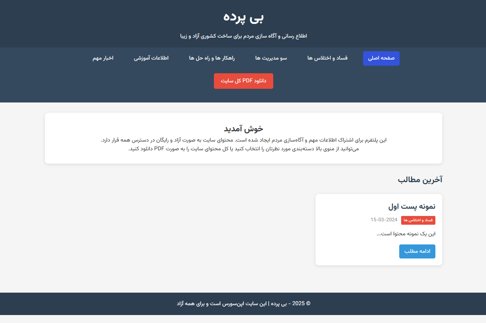

<div style="text-align: center">

[English Version](./README.md)

</div>

<div style="direction: rtl">

# بی پرده

یک وب سایت ساده برای اطلاع رسانی و آگاه سازی

## ویژگی‌ها

- ✅ بدون نیاز به دیتابیس (استفاده از فایل‌های جیسون)
- ✅ کاملاً پورتابل و قابل انتقال
- ✅ ریسپانسیو و موبایل-فرندلی
- ✅ پشتیبانی از راست چین برای فارسی
- ✅ امکان تولید پی دی اف (نیاز به کتابخانه اضافی)
- ✅ دسته‌بندی محتوا
- ✅ کد تمیز و قابل توسعه



## نصب و راه‌اندازی

### مرحله 1: دانلود فایل‌ها
فایل‌های زیر را در پوشه اصلی وب‌سایت قرار دهید:

### مرحله 2: ایجاد ساختار پوشه‌ها

<div style="direction: ltr">

```
your-website/
├── index.php صفحه اصلی
├── config.php  کانفیگ ها
├── helper.php  توابع کمکی
├── style.css  استایل ها
├── data/
│   └── posts/
│       ├── corruption/          (فساد و اختلاس‌ها)
│       ├── mismanagement/       (سوءمدیریت‌ها)
│       ├── solutions/           (راهکارها)
│       ├── education/           (آموزشی)
│       └── news/               (اخبار)
└── README.md
```

</div>

### مرحله 3: اضافه کردن محتوا

هر پست را به صورت یک فایل JSON در پوشه دسته‌بندی مربوطه قرار دهید:

#### مثال: `data/posts/corruption/post-001.json`

<div style="direction: ltr">

```json
{
  "title": "عنوان پست",
  "content": "متن کامل پست...",
  "date": "2024-03-15",
  "author": "نام نویسنده",
  "tags": ["برچسب1", "برچسب2"],
  "category": "corruption",
  "status": "published"
}
```

</div>

### مرحله 4: تنظیمات

می‌توانید تنظیمات اصلی را در فایل `config.php` تغییر دهید:

<div style="direction: ltr">

```php
$config = [
    'site_title' => 'عنوان سایت شما',
    'site_description' => 'توضیحات سایت',
    'categories' => [
        'corruption' => 'فساد و اختلاس‌ها',
        // سایر دسته‌بندی‌ها...
    ]
];
```

</div>

## حداقل نیازمندی‌های سرور

- PHP 7.4 یا جدیدتر
- دسترسی نوشتن به پوشه (برای آپلود فایل‌ها)
- Apache یا Nginx

## ویژگی‌های اضافی

### تولید PDF
برای فعال‌سازی تولید PDF، نیاز به نصب کتابخانه TCPDF دارید:

```bash
composer require tecnickcom/tcpdf
```

سپس کد مربوط به PDF را در فایل `index.php` تکمیل کنید.

### پشتیبان‌گیری

برای پشتیبان‌گیری، کافیست کل پوشه سایت را کپی کنید. هیچ دیتابیسی وجود ندارد.

## مشارکت

این پروژه کاملا آزاد و اپن‌سورس است. می‌توانید:
- کد را تغییر دهید
- ویژگی جدید اضافه کنید
- با دیگران به اشتراک بگذارید

## پشتیبانی

برای سوالات یا مشکلات، می‌توانید Issue جدید ایجاد کنید.

## مجوز

این پروژه کاملا رایگان است.

---

**نکته امنیتی:** اگر قرار است از این سایت در شرایط حساس استفاده کنید، حتماً از VPN و سرورهای امن استفاده کنید و اطلاعات حساس را رمزنگاری کنید.


</div>